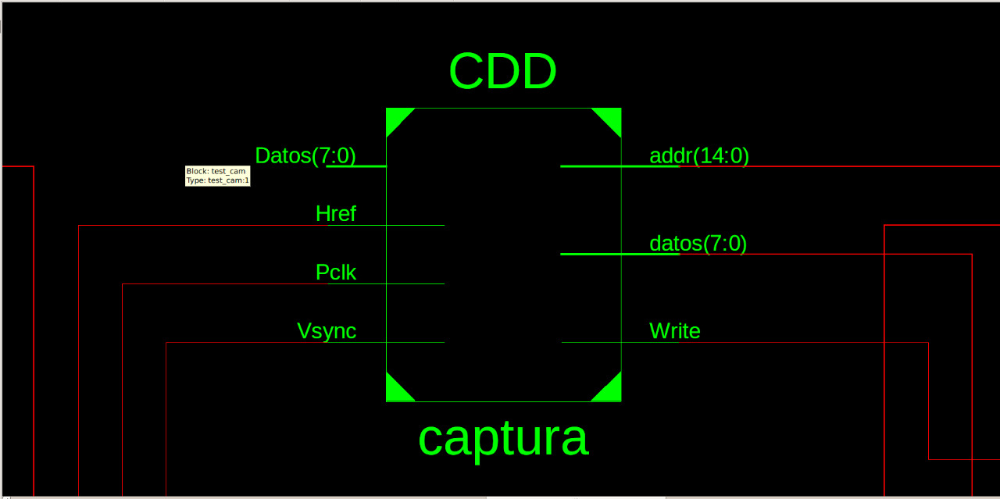
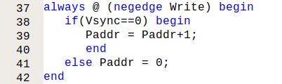
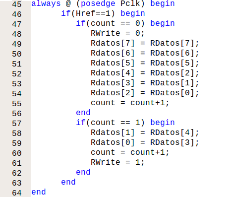
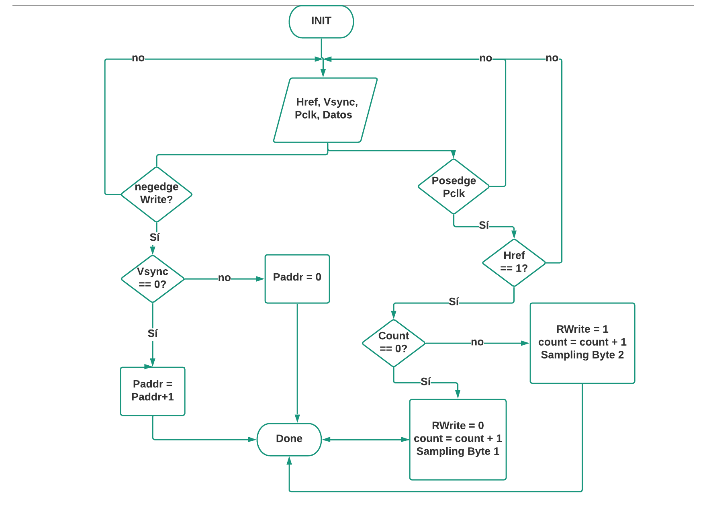

# Módulo de Captura de Datos

Para desarrollar el módulo de captura de datos necesitamos 4 señales de entrada (entre ellas un bus de datos), estas señales provienen de la cámara OV7670 y son:

* Pclk
* Vsync
* Href
* Datos [7:0]

Las salidas del módulo son:

* datos [7:0] (la información de un pixel, es decir, en formato RGB332)
* addr [14:0] (indica la dirección asociada al pixel)
* Write (Registro de escritura)

Tal y como se observa en el siguiente diagrama o caja negra.

Se crearon 5 registros, dos son las señales de entrada y salida, uno la dirección que se asocia a cada pixel, el registro de escritura y un contador de 1 bit que nos indicará los datos a seleccionar de cada bus de datos que se recibe.

* RDatos [7:0] (registro de bus de entrada)
* Rdatos [7:0] (registro de bus de salida)
* Paddr [14:0] (dirección del bus de salida o pixel)
* RWrite (registro de escritura)
* count (inicializado con valor 0, indicará los datos que se deben tomar del bus de entrada)

Lo primero que debemos hacer es saber cuando tomar datos, la toma de datos se debe realizar cuando Vsync este en estado bajo (Vsync = 0), esta entrada es cero durante el tiempo necesario para cargar los pixeles de toda la pantalla, y cada que se reciba un nuevo bus de datos se debe cambiar la dirección (Paddr=Paddr+1). Es importante tener en cuenta que la toma de datos y la escritura no se hacen simultaneamente.

El ritmo de la toma de datos está dado por la entrada *Pclk* y además de tener a *Vsync* en estado bajo se debe tener a *Href* en estado alto (Href = 1). Cada vez que se pase por un flanco de subida del Pclk se debe revisar el valor de nuestro count, este nos indicará que valores se deben tomar (Downsampling). La cámara nos envía un bus de datos de 8 bits (1 Byte), con 2 Bytes tenemos la información de un pixel en formato RGB565 como se ilustra en la siguiente tabla.

Byte 1  |  Byte 2
----------------|---------------
R R R R R G G G | G G G B B B B B
0 1 2 3 4 5 6 7 | 0 1 2 3 4 5 6 7

Para pasarlo a formato RGB332 se toman los datos más significativos de cada color. En el caso del primer Byte se dejaría de tomar los bits 3 y 4, mientras que en el caso del Byte 2 se toman los bits 3 y 4. Con el registro *count* se puede escoger que tipo de muestreo (sampling) se debe realizar, si el correspondiente al del primer Byte o al segundo Byte. De tal manera que nuestro dato de salida es 1 Byte por cada  2 Bytes de entrada.

Byte 1  |  Byte 2
----------------|---------------
R R R R R G G G | G G G B B B B B
0 1 2 X X 5 6 7 | X X X 3 4 X X X

Cada vez que se muestree uno de los Bytes se debe sumar +1 a *count*, ya que este es quien determina que se debe hacer el siguiente muestreo. *count* puede ser 0 o 1. 

## Diagrama de flujo

